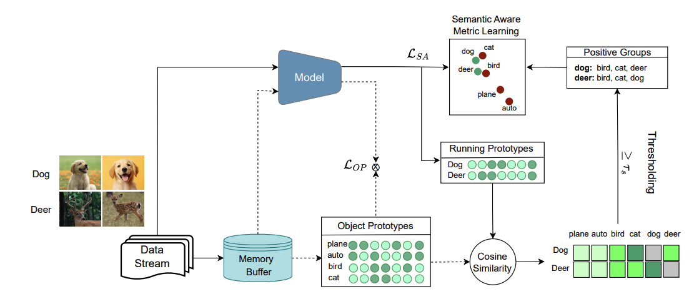

# Semantic Aware Representation Learning (SARL) - Optimization Suite

Official Repository for the ICLR'25 paper [Semantic Aware Representation Learning for Lifelong Learning](https://openreview.net/forum?id=WwwJfkGq0G&noteId=JBzQCQBACo)

This repository contains optimized implementations of SARL with several enhancements and variants for improved continual learning performance.

## Overview



SARL employs activation sparsity to emulate brain-like sparse coding, representing each object with a class prototype derived from the mean representations of object samples. The semantic relationships are utilized to encourage new object prototypes to align with the class prototypes of similar objects and diverge from dissimilar ones.

## 🚀 Available Models

### 1. **Original SARL** (`sarl`)

- Base implementation from the ICLR'25 paper
- Uses cosine similarity for semantic grouping
- Supports sparse ResNet18 and MLP backbones

### 2. **Enhanced SARL** (`sarl_enhanced`)

- **Learnable Semantic Similarity**: Replaces fixed cosine similarity with neural network
- **Soft Semantic Weighting**: Continuous relationships instead of binary grouping
- **Enhanced Contrastive Loss**: Weighted contrastive learning with semantic guidance

### 3. **Enhanced SARL with GELU** (`sarl_enhanced_gelu`)

- Uses GELU activations for improved performance
- Enhanced semantic learning with contrastive-based similarity
- Optimized for better gradient flow

### 4. **Balanced Sampling SARL** (`sarl_enhanced_gelu_balanced`)

- **Balanced Instance Sampling**: Addresses bias in semantically similar class sampling
- **Importance-Weighted Replay**: Prioritizes underrepresented semantic groups
- **Adaptive Thresholding**: Dynamic semantic group assignment

## 📊 Supported Datasets

- **Sequential CIFAR-10** (`seq-cifar10`)
- **Sequential CIFAR-100** (`seq-cifar100`)
- **Sequential TinyImageNet** (`seq-tinyimg`)
- **GCIL-CIFAR100** (`gcil-cifar100`)
- **Sequential ImageNet-100** (`seq-imagenet100`)
- **Permuted MNIST** (`perm-mnist`)
- **Rotated MNIST** (`rot-mnist`)
- **Sequential MNIST** (`seq-mnist`)
- **MNIST-360** (`mnist-360`)

## 🛠️ Installation

```bash
git clone https://github.com/DngBack/SARL_Optim.git
cd SARL_Optim
pip install -r requirements.txt
```

## 🔧 Requirements

```text
torch==2.7.1
torchvision==0.22.1
tqdm==4.67.1
timm==1.0.17
quadprog==0.1.13
```

## 🏃‍♂️ Quick Start

### Basic Usage

```bash
# Run original SARL on Sequential CIFAR-10
python main.py --model sarl --dataset seq-cifar10 --buffer_size 200

# Run enhanced SARL with learned semantic similarity
python main.py --model sarl_enhanced --dataset seq-cifar10 --buffer_size 200

# Run enhanced SARL with GELU activations
python main.py --model sarl_enhanced_gelu --dataset seq-cifar10 --buffer_size 200

# Run balanced sampling SARL (most advanced)
python main.py --model sarl_enhanced_gelu_balanced --dataset seq-cifar10 --buffer_size 200
```

### Using Optimized Scripts

For experiments with paper-tested hyperparameters:

```bash
# Original SARL
python scripts/sarl/seq-cifar10.py
python scripts/sarl/seq-cifar100.py
python scripts/sarl/seq-tinyimg.py
python scripts/sarl/gcil-cifar100.py

# Enhanced SARL variants
python scripts/sarl_enhanced/seq-cifar10.py
python scripts/sarl_enhanced_gelu/seq-cifar10.py
python scripts/sarl_enhanced_gelu_balanced/seq-cifar10.py
```

### Quick Testing

```bash
# Test enhanced SARL on CIFAR-10 (minimal epochs)
python test_enhanced_sarl_cifar10.py

# Run enhanced GELU variant with different modes
python run_sarl_enhanced_gelu_cifar10.py quick    # 2 epochs, 1 seed
python run_sarl_enhanced_gelu_cifar10.py best     # 50 epochs, 3 seeds

# Compare all SARL variants
python compare_sarl_models.py
```

## ⚙️ Key Parameters

### Common Parameters

- `--model`: Model type (sarl, sarl_enhanced, sarl_enhanced_gelu, sarl_enhanced_gelu_balanced)
- `--dataset`: Dataset name (seq-cifar10, seq-cifar100, etc.)
- `--buffer_size`: Memory buffer size (200, 500)
- `--alpha`: Prototype regularization weight (0.2-0.5)
- `--beta`: Object prototype weight (1.0)
- `--op_weight`: Operational weight (0.5)
- `--kw`: k-winners sparsity levels (e.g., "0.8 0.8 0.8 0.8")

### Enhanced SARL Specific

- `--sim_lr`: Learning rate for semantic similarity network (0.001)
- `--sm_weight`: Semantic similarity loss weight (0.01)

### Balanced Sampling Specific

- `--balance_alpha`: Balance factor for importance sampling (1.0)
- `--adaptive_temp`: Temperature for adaptive thresholding (0.5)

## 📈 Model Architecture Features

### Enhanced Semantic Learning

```python
class SemanticSimilarity(nn.Module):
    """Learnable semantic similarity network"""
    def __init__(self, feat_dim, hidden_dim=128):
        self.similarity_net = nn.Sequential(
            nn.Linear(feat_dim * 2, hidden_dim),
            nn.ReLU(),
            nn.Dropout(0.1),
            nn.Linear(hidden_dim, 1),
            nn.Sigmoid()
        )
```

### Balanced Instance Sampling

```python
# Importance-weighted sampling for balanced replay
importance = (1 / (semantic_similarity + ε)) × balance_factor
indices = torch.multinomial(importance, minibatch_size)
```

## 📖 Additional Documentation

- [Enhanced SARL Details](ENHANCED_SARL_README.md) - Comprehensive guide to enhanced variants
- [Balanced Sampling Guide](BALANCED_SAMPLING_README.md) - Detailed explanation of balanced sampling

## 🎯 Performance Tips

1. **Buffer Size**: Use 200-500 for CIFAR datasets, larger for complex datasets
2. **Learning Rate**: Start with 0.03, adjust based on dataset complexity
3. **Sparsity**: Higher sparsity (0.8-0.9) generally works better
4. **Enhanced Models**: Use enhanced variants for better semantic learning

## 📝 Citation

```bibtex
@inproceedings{sarfrazsemantic,
  title={Semantic Aware Representation Learning for Lifelong Learning},
  author={Sarfraz, Fahad and Arani, Elahe and Zonooz, Bahram},
  booktitle={The Thirteenth International Conference on Learning Representations}
}
```

## 📄 License

This project extends the [SCoMMER](https://github.com/NeurAI-Lab/SCoMMER) repository. See LICENSE files for details.
